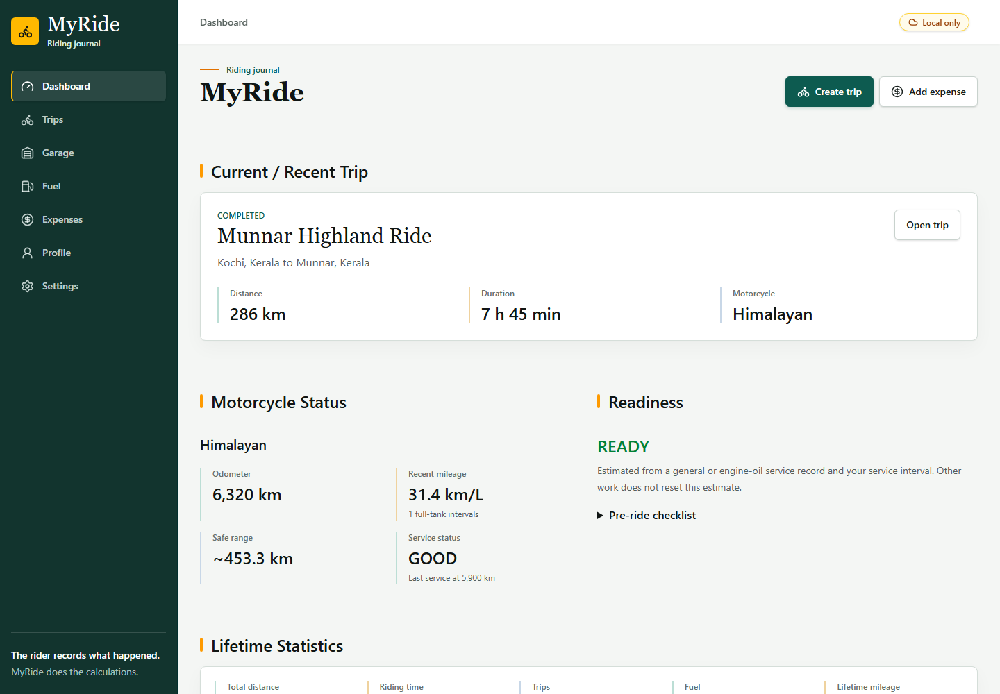
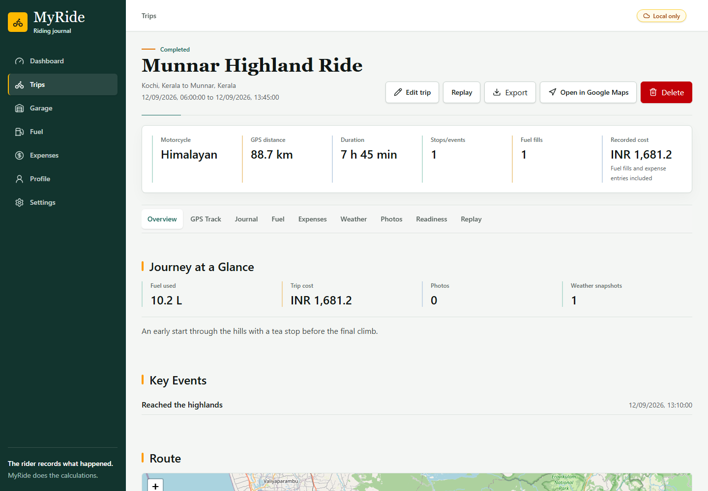
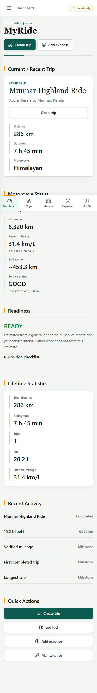

# MyRide

**Record the ride. Preserve the journey.**

MyRide is a privacy-conscious, offline-first motorcycle journal for recording complete riding histories. It keeps trips, GPS routes, fuel, expenses, maintenance, photos, weather, checkpoints, and milestones connected to the exact motorcycle and journey they belong to.

The application starts empty and never inserts fictional records into a rider's journal. Core functionality works locally without an account, cloud service, or AI provider.

> Suggested GitHub description: An offline-first motorcycle trip journal for routes, fuel, expenses, maintenance, photos, weather, and riding history.

## Preview



<details>
<summary>More screens</summary>

### Journey dossier



### Mobile dashboard



</details>

## Highlights

- **Local-first journal:** IndexedDB is the source of truth, so trips remain readable and editable offline.
- **Complete journey records:** Store origin, destination, planned stops, GPS points, checkpoints, events, photos, weather, costs, and notes under immutable trip IDs.
- **Motorcycle dossiers:** Keep odometer, fuel, service, component health, maintenance, and trip history isolated per motorcycle.
- **Verified fuel analytics:** Calculate full-tank-to-full-tank mileage, partial-fill intervals, fuel cost, and estimated range from raw observations.
- **Route capture and replay:** Record browser geolocation points, visualize routes and elevation, and replay completed journeys against their timelines.
- **Expense history:** Track riding costs by category, payment method, trip, motorcycle, and year.
- **Readiness and maintenance:** Maintain pre-ride checks, service history, due-state estimates, and optional reminders.
- **Installable PWA:** Cache the application shell and lazy-loaded pages for offline use.
- **Optional cloud sync:** Synchronize user-owned records and private photos through Supabase with row-level security.
- **Privacy-aware AI:** Answer deterministic questions locally, with optional OpenAI explanations that receive only the already-computed answer.
- **Accessible and responsive:** Keyboard-friendly controls, visible focus states, reduced-motion support, automated accessibility checks, and layouts tested from 320 px through desktop.

## Technology

| Area | Stack |
| --- | --- |
| UI | React 19, TypeScript, Tailwind CSS 4, Lucide icons |
| Routing | React Router |
| Local data | IndexedDB with Dexie |
| Server data | TanStack Query |
| UI state | Zustand |
| Maps | Leaflet and OpenStreetMap tiles |
| Charts | Recharts |
| Photos | browser-image-compression and EXIF parsing |
| Cloud | Supabase Auth, PostgreSQL, Storage, Edge Functions |
| PWA | Vite PWA and Workbox |
| Quality | Playwright, axe-core, oxlint, TypeScript, PGlite |

## Quick Start

### Requirements

- Node.js 22 or newer
- npm 10 or newer
- Chromium installed by Playwright for browser tests

### Install

Clone or download the repository, open the project directory, then run:

```bash
npm install
npm run dev
```

Open the URL printed by Vite. MyRide starts in **Local only** mode and needs no environment variables.

Browser geolocation requires permission and a secure context. It works on `localhost` during development and on HTTPS deployments.

## Configuration

Copy `.env.example` to `.env.local` only when optional integrations are needed:

```bash
cp .env.example .env.local
```

| Variable | Required | Purpose |
| --- | --- | --- |
| `VITE_SUPABASE_URL` | No | Public URL for an optional Supabase project |
| `VITE_SUPABASE_PUBLISHABLE_KEY` | No | Client-safe Supabase publishable key |
| `VITE_NOMINATIM_URL` | No | Alternative Nominatim-compatible geocoding endpoint |

Never add a Supabase service-role key, OpenAI key, or any other private credential to a `VITE_` variable. Vite embeds those values in browser code.

### Optional Supabase Sync

1. Create a Supabase project.
2. Run `supabase/schema.sql` in the SQL editor.
3. For an existing MyRide database, apply `supabase/migrations` in filename order.
4. Add the public project URL and publishable key to `.env.local`.
5. Restart the development server and sign in with email and password.

The schema creates private user-owned tables, row-level security policies, relationship checks, single-active-record constraints, and a private `trip-photos` bucket.

### Optional AI Explanations

Ask MyRide always calculates its answer locally. There are two optional ways to request a short OpenAI explanation:

**Device key:** Select OpenAI in Profile or Settings and save a personal API key. It remains in that browser's local storage, is excluded from sync and archives, and is removed by **Clear device data**. Browser storage is readable by scripts on the same origin, so use this only on a trusted device and deployment.

**Supabase Edge Function:** Deploy `supabase/functions/explain-myride` with JWT verification and configure these Edge Function secrets:

```text
OPENAI_API_KEY=
OPENAI_MODEL=
MYRIDE_OWNER_USER_ID=
```

Only the locally computed answer is sent to OpenAI. The original question, journal, profile, emergency contacts, and medical notes are not sent. Requests use `store: false`, and generated numerical claims are rejected.

## Usage

1. Add a motorcycle in **Garage** and make it active.
2. Create a trip with an origin, destination, dates, motorcycle, and optional stops.
3. Start the trip and record checkpoints, GPS points, fuel, expenses, photos, events, and weather.
4. End the trip to preserve its final distance and duration.
5. Review the journey dossier, map, timeline, costs, weather, media, and replay.
6. Export a JSON archive from Settings for a portable local backup.

MyRide records routes; it does not provide turn-by-turn navigation. Google Maps links are offered where external navigation is useful.

## Project Structure

```text
src/
  components/          Shared application and UI components
  db/                  Dexie database definition
  hooks/               React Query data hooks
  layouts/             Responsive application shell
  lib/                 Third-party client configuration
  pages/               Route-level screens
  repositories/        Local persistence and transaction boundary
  services/            Domain logic and external integrations
  stores/              Transient Zustand UI state
  types/               Domain models
  utils/               Formatting and distance utilities
supabase/
  functions/           Optional AI Edge Function
  migrations/          Ordered database upgrades
  schema.sql            Fresh database schema and RLS policies
tests/                  Browser, domain, sync, accessibility, and PWA tests
scripts/                Schema, icon, and screenshot tooling
docs/                   Architecture, deployment, privacy, and screenshots
```

See [Architecture](docs/ARCHITECTURE.md) for the data flow, synchronization model, and ownership boundaries.

## Quality Checks

```bash
npm run typecheck
npm run lint
npm run build
npm run check:edge
npm run test:edge
npm run test:schema
npx playwright install chromium
npm run test:e2e
npm run test:sync
npm run test:pwa
```

Run the complete release gate with:

```bash
npm run verify
```

The suite covers empty-state behavior, immutable trip identity, editing and deletion, multi-motorcycle isolation, parent ownership, fuel calculations, expense totals, GPS tracking, route replay, photos, weather, maintenance, profile privacy, backups, offline writes, cloud conflict resolution, accessibility, and responsive rendering.

`npm run generate:screenshots` recreates the tracked portfolio screenshots from isolated sample records. It does not add demo data to the application.

## Offline and Data Behavior

- IndexedDB remains available without a network connection.
- Maps, location search, nearby fuel search, fresh weather, cloud sync, and cloud AI require connectivity.
- GPS tracking continues while MyRide remains open; mobile browsers may suspend web applications in the background or when the screen is locked.
- Archive exports include photos and private profile fields and are not encrypted.
- Missing coordinates, weather, mileage, and records are never fabricated or replaced with sample data.

Read [Privacy and Security](docs/PRIVACY.md) before deploying the app for personal use.

## Deployment

The included `vercel.json` supports direct loading of client-side routes. Build with `npm run build` and publish `dist` on Vercel or another HTTPS static host.

Detailed instructions are available in [Deployment](docs/DEPLOYMENT.md).

## Current Platform Limits

- Web geolocation is subject to browser permissions and background-execution limits.
- Public map, geocoding, fuel-station, and weather providers can be unavailable or rate-limited.
- Cloud sync and AI are optional; the local journal remains functional when either is unavailable.
- Automated browser coverage uses Chromium. Real-device checks are still recommended for GPS, camera, installation, and screen-lock behavior.

## Attribution

- Map data and tiles: [OpenStreetMap contributors](https://www.openstreetmap.org/copyright)
- Map rendering: [Leaflet](https://leafletjs.com/)
- Location search: [Nominatim](https://nominatim.org/)
- Weather data: [Open-Meteo](https://open-meteo.com/)
- Interface icons: [Lucide](https://lucide.dev/)
- Optional cloud platform: [Supabase](https://supabase.com/)
- Optional AI provider: [OpenAI](https://openai.com/)

Provider names and marks belong to their respective owners. Review provider usage policies before operating a public deployment at scale.

## Contributing and Security

Contributions are welcome. Read [CONTRIBUTING.md](CONTRIBUTING.md) before opening a pull request. Please report security issues according to [SECURITY.md](SECURITY.md) rather than in a public issue.

## License

MyRide is available under the [MIT License](LICENSE).
